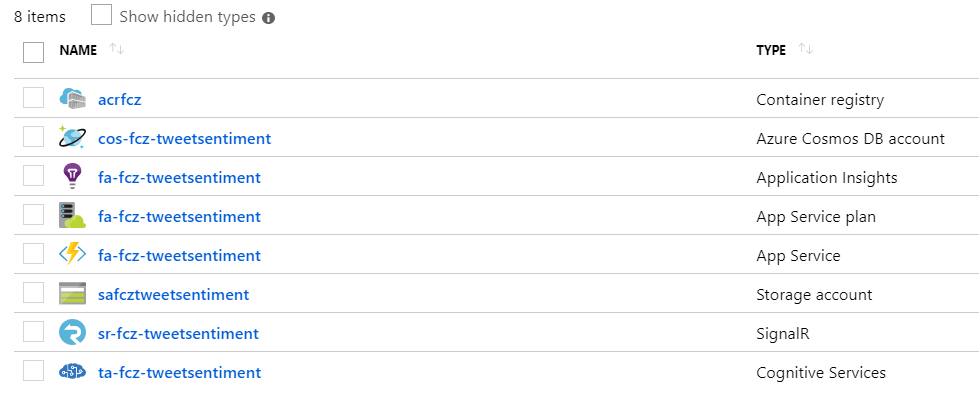
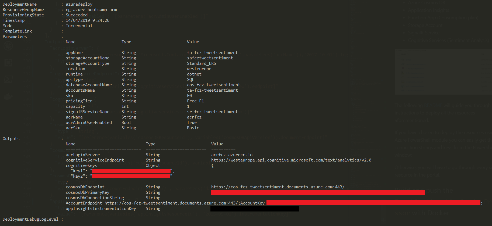
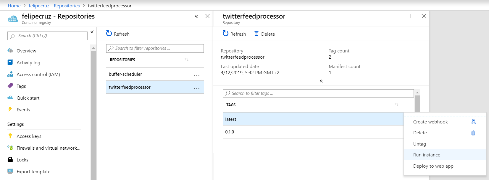
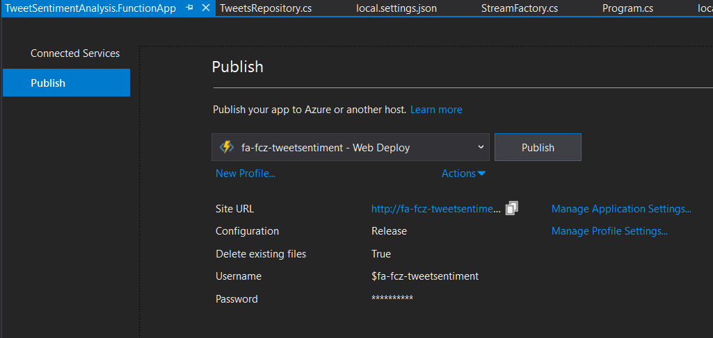
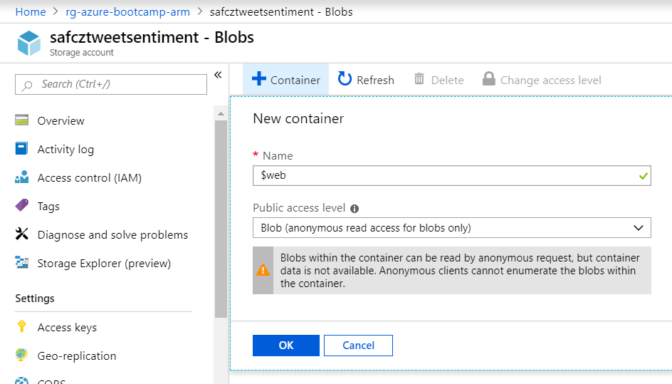
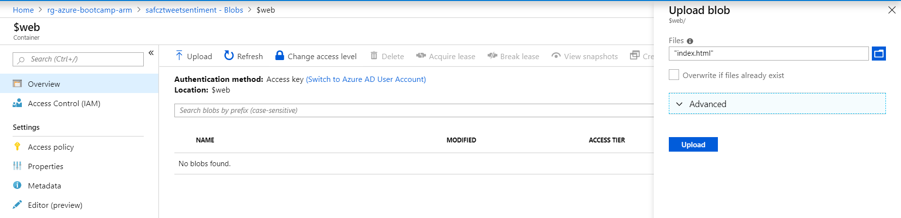
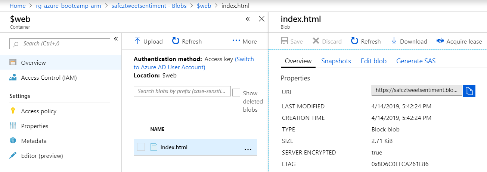
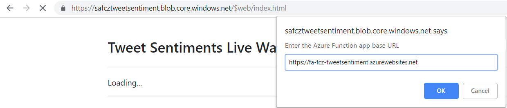

# Tweet Sentiment Analysis 💬➡🧠➡[😊|😐|😥]

## Summary

 *Real-time* tweet sentiment analysis (positive/neutral/negative) and visualization in a .NET Core Web App.
 
 The tweets that are retrieved in *real-time* from the Twitter Stream will be processed and analyzed by the Azure Sentiment Analysis API and persisted in Cosmos DB. 
 Finally, both the tweet text and sentiment will be displayed in the Web App as they come through.

## Index

- [Architecture diagram](#architecture-diagram)
- [Requirements](#requirements)
- [Steps](#steps)

## Architecture diagram

## Requirements

You will need the following tools to complete the hands-on lab.

- Visual Studio 2017
- [Azure Functions Core Tools V2](https://github.com/Azure/azure-functions-core-tools#windows)
- Docker
- Azure account
- Twitter App. If you don't have one, create one [here](https://developer.twitter.com/en/apps).

## Deploy the infrastructure to Azure

You will be deploying the following resources to Azure using an already defined [ARM template](./arm-template/azuredeploy.json):

- Container registry
- Azure Cosmos DB
- Application Insights
- Function App (Consumption plan)
- Storage Account
- SignalR Service
- Cognitive Services (Sentiment Analysis)

The following [README](./arm-template/README.md) will guide you through the instructions to deploy all the resources aforementioned.

> **Important**: Before deploying the infrastructure, make sure you set your own resource names in the [parameters file](./arm-template/azuredeploy.parameters.json).

If you have chosen to deploy the resources using the Azure PowerShell module you can easily get the connection strings and keys from the PowerShell window; otherwise, you will have to go through every single resource in the portal and find the keys.

Next step is to update the file with your keys:

    {
        "TextAnalytics": {
            "Name": "<your-cognitive-service-resource-name>",
            "Key1": "<cognitivekeys-key1>",
            "Key2": "<cognitivekeys-key2>"
        },
        "CosmosDB": {
            "EndpointUrl": "<cosmosDbEndpoint>",
            "AuthorizationKey": "<cosmosDbPrimaryKey>"
        }
    }

Once you have done that, make sure you rename the `appsettings.sample.json` file to `appsettings.json`.

## Build and push the `TweetSentimentAnalysis.Processor` with Docker

The `TweetSentimentAnalysis.Processor` is a .NET Core App 2.2 that listens to the Twitter Stream for tweets given a `keyword` - you must set it in the `appsettings.json` file or pass it as an environment variable when you *run* the docker image.

### Login to your Azure Container Registry

    λ docker login <your-docker-registry> -u <your-user> -p <your-password>

    Example:
    λ docker login acrfcz.azurecr.io -u myuser -p 1234

    WARNING! Using --password via the CLI is insecure. Use --password-stdin.
    Login Succeeded

### Build and publish the docker image

    λ build-and-push.cmd <your-docker-registry> <docker-img-version>

    Example:
    λ build-and-push.cmd acrfcz.azurecr.io 0.1.0

### Run the docker image (locally)

    λ docker run -it --rm -e "Keyword=I love coding" twitterfeedprocessor

    [04/12/2019 16:15:12] - Starting program...
    [04/12/2019 16:15:12] - Environment:
    [04/12/2019 16:15:12] - Starting listening for tweets that contains the keyword 'I love coding'...

or... 

### Run the docker image (as an Azure Container Instance)

## Deploy the Azure Function

Make a copy of the `local.settings.sample.json` file that is present in the `TweetSentimentAnalysis.FunctionApp` folder and rename it to `local.settings.json`. Then update the following values according to the resources you created:

    {
        "IsEncrypted": false,
        "Values": {
            "CosmosDbConnectionString": "<cosmosdb-connection-string>",
            "FUNCTIONS_WORKER_RUNTIME": "dotnet",
            "AzureSignalRConnectionString": "<signalr-connection-string>"
        }
    }

Within Visual Studio, right click on the `TweetSentimentAnalysis.FunctionApp` project and select `Publish...`

## Host your website in Blob Storage

Now it's time to build our *serverless* web app that consists of an index.html in Vue.js and with the SignalR JS libraries to interact with our backend (the Azure Function).

In the storage account, let's create a new blob container with the following configuration:

- Name: `$web`
- Public access level: `Blob (anonymous read access for blobs only)`

This will allow our *serverless* web app to be publicly available instead of private.

Then click in the container and just upload the [index.html](./docs/demo/app/index.html) file:

You can find your *serverless* web app URL by clicking on the blob:

Example:

    https://safcztweetsentiment.blob.core.windows.net/$web/index.html

Once you click on it, a pop-up will appear. Enter the Azure Functionapp base URL and press OK.

Some tweets should start appearing now :)