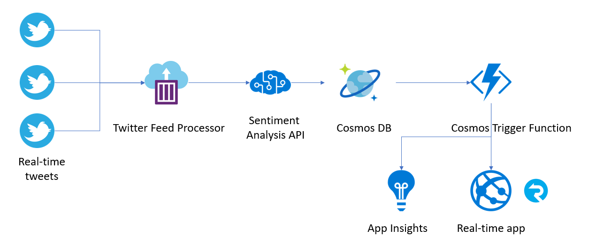
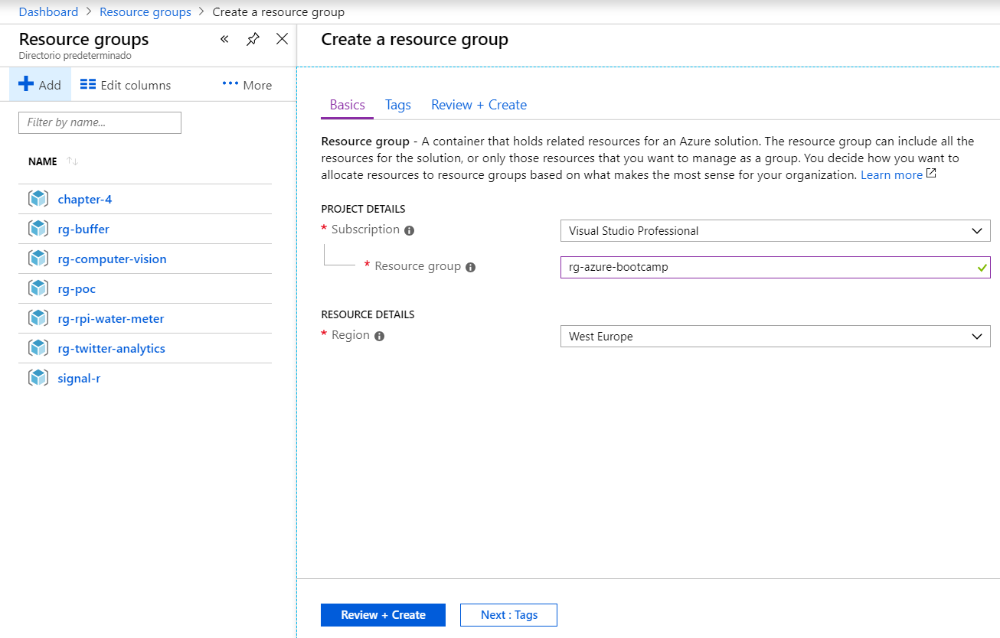
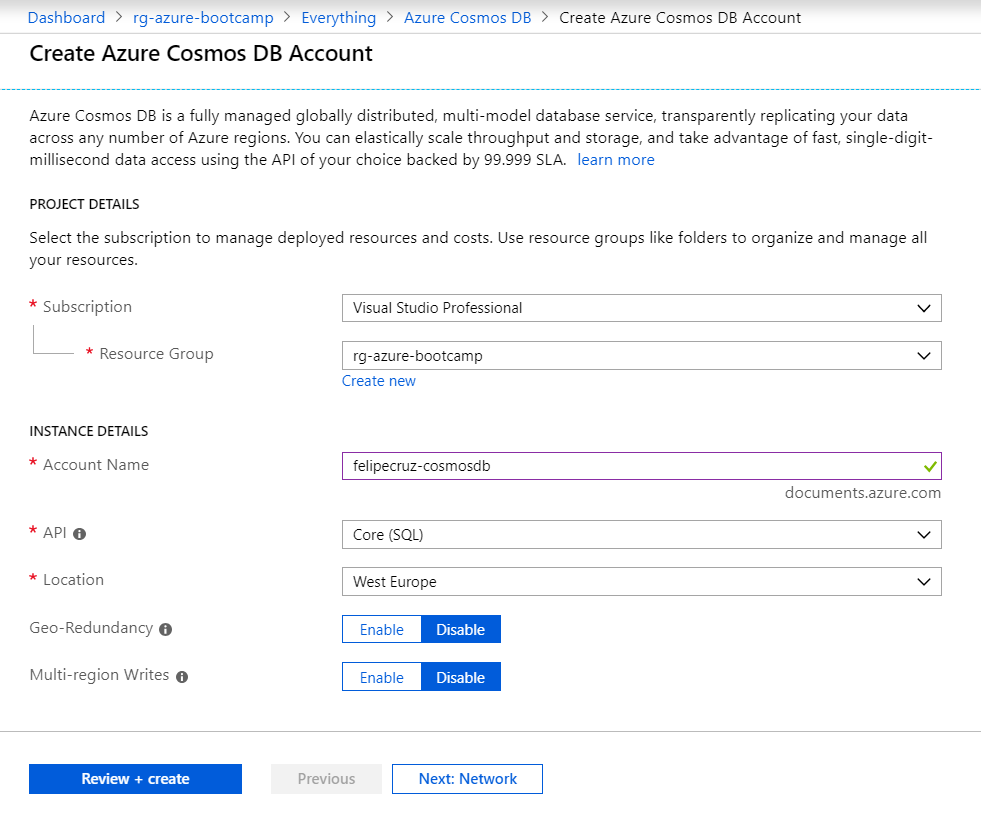
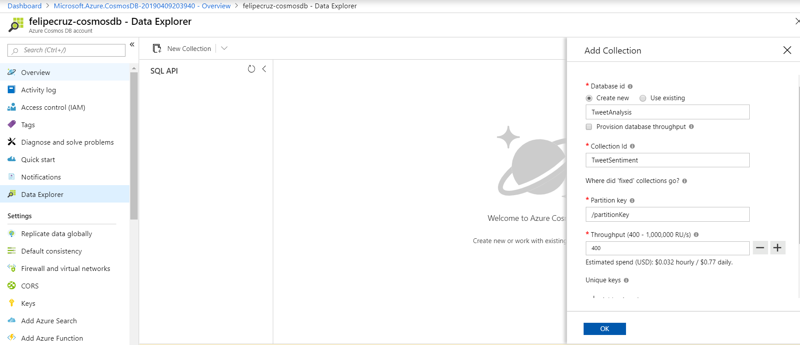
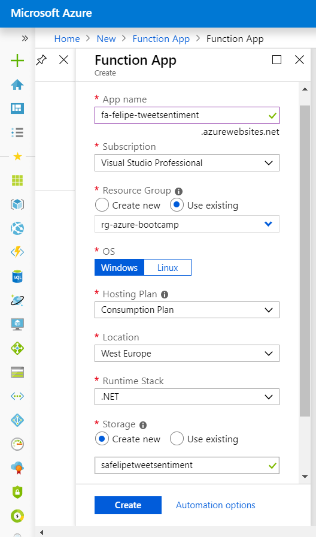
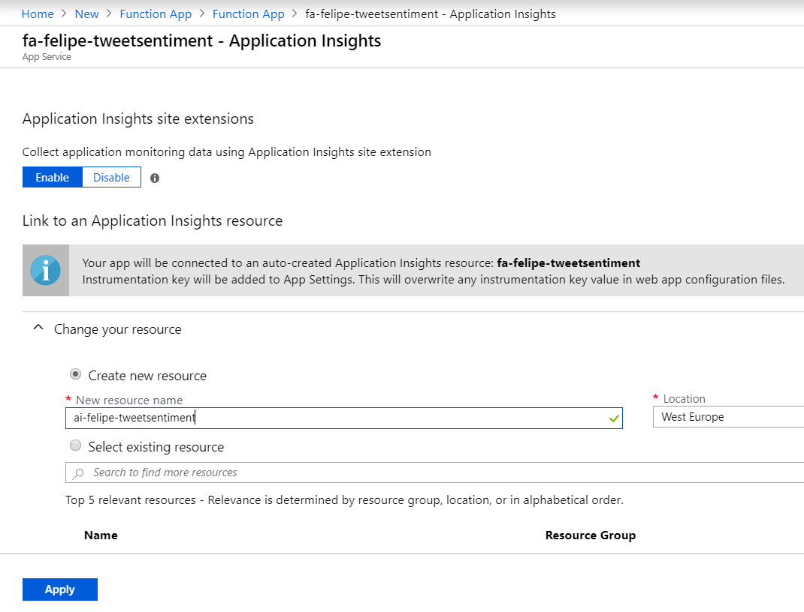

# Tweet Sentiment Analysis 💬➡🧠➡[😊|😐|😥]

## Summary

 *Real-time* tweet sentiment analysis (positive/neutral/negative) and visualization in a .NET Core Web App.
 
 The tweets that are retrieved in *real-time* from the Twitter Stream will be processed and analyzed by the Azure Sentiment Analysis API and persisted in Cosmos DB. 
 Finally, both the tweet text and sentiment will be displayed in the Web App as they come through.

## Index

- [Architecture diagram](#architecture-diagram)
- [Requirements](#requirements)
- [Steps](#steps)

## Architecture diagram

## Requirements

You will need the following tools to complete the hands-on lab.

- Visual Studio 2017
- Docker
- Azure account

## Steps

1. Create a resource group with name `rg-azure-bootcamp`

    

2. Create an Azure Cosmos DB Account under the `rg-azure-bootcamp` resource group that you have created in the previous step.

    

        Resource Group  rg-azure-bootcamp
        Location        West Europe
        Account Name    (new) felipecruz-cosmosdb
        API             Core (SQL)
        Geo-Redundancy  Disable
        Multi-region Writes Disable

3. Create both a new database and a new collection under the Cosmos DB account you created in the previous step.

    

        Database Id     TweetAnalysis
        Collection Id   TweetSentiment
        Partition Key   /partitionKey
        Throughput      400

4. ⚡ Create a Function App that will be used to create the Cosmos Trigger Function afterwards. Make sure you select to create an App Insights resource as part of the creation of the Function App.

    

    
    